# Konami System GX core for MiSTer

A MiSTer FPGA core for Konami's [System GX](https://en.wikipedia.org/wiki/Konami_System_GX)
arcade hardware (MAME's `konami/konamigx.cpp`), built with Quartus Prime 17.0.2 Lite for the
DE10-nano.

## Contents

- [History](#history)
- [Status](#status)
- [Games](#games)
  - [Supported](#supported)
  - [Out of scope for now](#out-of-scope-for-now)
- [Hardware](#hardware)
  - [Video timing](#video-timing)
  - [CRT Adjust](#crt-adjust)
- [Screenshots](#screenshots)
- [Installation](#installation)
  - [Todo](#todo)
  - [Resource usage](#resource-usage)
- [AI Attestation](#ai-attestation)
- [Verification](#verification)
- [Acknowledgements](#acknowledgements)
- [Layout](#layout)
- [License](#license)

## History

* **Arcade-KonamiGX_20260928**
  * Sprites now keep up on busy lines due to various optimisations: Fixes Crazy Cross intro, Dragoon, Salamnder 2 later levels
  * EEPROM support
  * CRT Adjust

* **Arcade-KonamiGX_20260927**
  * **Beta**
  * Sprites still run out of line time on Dragoon Might's and Winning Spike's busiest lines
  * EEPROM is not saved.

## Status

**Status**: All listed games run and are playable with sound. The zoomed sprite rendering is arguably more accurate than MAME, using a single acculator for pixels when crossing multiple tiles in a sprite, versus MAME's whole pixel granularity.

Graphically, they're still WIP - but MAME has seen some great improvements in the past couple of weeks (targeted for MAME 0.290) thanks to R.Belmont, and that's reflected here too.

Known issues:
* **Dragoon Might's power-on memory check can fail 4F and 4H**, the sound DSP's RAM test: the DSP
  has not finished it when the sound CPU gives up waiting. Resetting the core from the OSD passes
  it.
* **Saving settings in Dragoon Might's service menu stops on "EEPROM CHECKSUM ERROR"** and the game
  has to be reset. The settings are written: opening the OSD saves them, and they are there on the
  next launch. The save routine (0x243b1e) reads every word back and compares the byte sum with
  word 0; that check fails on the core although the EEPROM it leaves passes it, and the boot, which
  reads with the same routine, does not fail. Not yet explained; the 93C46's busy time did not fix
  it.

`docs/MAME_KLUDGES.md` lists what is taken from MAME as behaviour and what is known not to be right.
`docs/ROADMAP.md` is the plan and its progress; `docs/LESSONS_LEARNED.md` is what it cost.

## Games

Initial goal is the Type 2 boards of `konamigx.cpp`

### Supported

Every Type 2 set in `konamigx.cpp` except the bootleg.

| Name | Year | Tiles | Sprites | Notes |
|-|-|-|-|-|
| Daisu-Kiss | 1996 | 5bpp | 5bpp | ESC `generate_sprites` |
| Crazy Cross / Taisen Puzzle-dama | 1994 | 5bpp | 5bpp | |
| Fantastic Journey / Gokujou Parodius | 1994 | 5bpp | 5bpp | Fantastic Journey's DMA at 0xdb0000 |
| Twin Bee Yahhoo! / Magical Twin Bee | 1995 | 5bpp | 5bpp | ESC `generate_sprites` |
| Sexy Parodius | 1996 | 5bpp | 5bpp | `UNEMULATED_PROTECTION` in MAME |
| Taisen Tokkae-dama | 1996 | 6bpp | 5bpp | |
| Tokimeki Memorial Taisen Puzzle-dama | 1995 | 6bpp | 5bpp | ESC `esc_alert`; MAME's ROM patch carried in the `.mra` |
| Dragoon Might | 1995 | 5bpp | 4bpp | 16 MB of sprites; six buttons; sprites can run out of line time |
| Winning Spike | 1997 | 8bpp | 8bpp | Type 4 Xilinx protection |
| Salamander 2 | 1996 | 6bpp | 6bpp | ESC `esc_alert` mode 1 |
| Lethal Enforcers II | 1994 | 8bpp | 8bpp | Light guns: stick, d-pad or mouse, button 2 reloads, crosshair option; UAA and JAA flip their own screen |

### Out of scope for now

| MAME description | Why |
|-|-|
| Type 1: Racin' Force, Konami's Open Golf Championship, Golfing Greats 2 | `MACHINE_NOT_WORKING` in MAME; K053936 road plane, ADC0834, a LAN device MAME lacks; Open Golf is 33 MB |
| Type 3: Soccer Superstars | Two monitors on alternating frames, a second CRTC and palette, PSAC2 |
| Type 4: Versus Net Soccer, Run and Gun 2, Slam Dunk 2, Rushing Heroes | As Type 3; Rushing Heroes is 59 MB |
| Sexy Parodius (bootleg) | Two OKI6295s for sound, `MACHINE_NOT_WORKING` |

## Hardware

| Chip | Function | Status |
|-|-|-|
| 68EC020 @ 24 MHz | Main CPU | TG68K.C, on its own 24 MHz clock; a 16 KB ROM cache in front of the SDRAM |
| K053252 | CRTC, interrupts | jotego's, verified against MAME's timing |
| K054156 / K056832 | Four tilemap layers, 16 pages of VRAM | Written here (5, 6 and 8bpp), pixel-exact against MAME on captured frames |
| K053246 / K055673 | 256 sprites, zoom, shadows, 4 to 8bpp | jotego's K053246 with GX changes and a keyed line buffer; pixel-exact against MAME |
| K055555 | Priority mixer | Written here from MAME's `konamigx_mixer`, pixel-exact against MAME |
| K054338 | Alpha blending, shadows, background | Written here with the mixer |
| ESC | Sprite-list protection | MAME's `generate_sprites`, `esc_alert` modes 0 and 1 and Winning Spike's Type 4 protection, as a bus master |
| 93C46 | Serial EEPROM | Written here from MAME's `eepromser`; loaded with the set's default image from the `.mra`; not yet saved to the `.nvm` file |
| K056800 | Sound mailbox | Written here from MAME's `k056800.cpp` |
| 68000 @ 8 MHz | Sound CPU | fx68k, cycle-accurate, running the game's sound program |
| K054539 ×2 | PCM, 8 channels each | Written here from MAME's `k054539.cpp`: 8-bit, 16-bit and DPCM samples, reverb in the chip's RAM |
| TMS57002 | Effects DSP | Written here against MAME's `tms57002.cpp`; its 256 KB of RAM in SDRAM |

### Video timing

The dot clock is 6 MHz (`wrport2 & 3` = 0 on every set so far), 384 dots per line and 264 lines
per frame, from the K053252's own registers:

* 6,000,000 / 384 = **15,625 Hz** line rate
* 15,625 / 264 = **59.19 Hz** frame rate

288 × 224 visible. MAME's `konamigx()` declares `set_raw(8000000, 512, ...)`, 60 Hz; the values
above are what the game programs into the CRTC.

## Screenshots

### Daisu-Kiss (ver JAA)

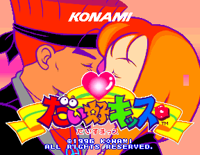
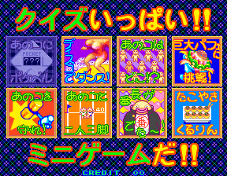
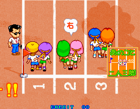
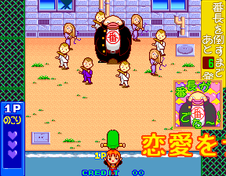

### Crazy Cross (ver EAA)

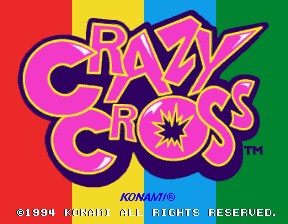

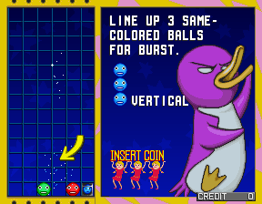

### Fantastic Journey (ver EAA)

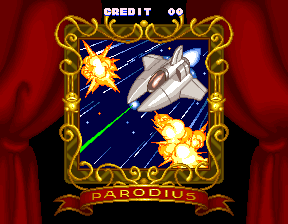
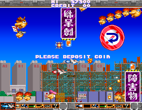

### Magical Twin Bee (ver EAA)

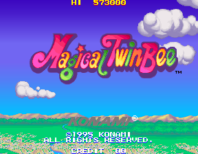
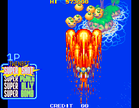

### Sexy Parodius (ver AAA)

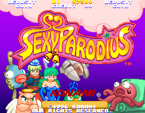
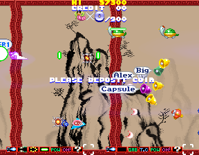

### Taisen Tokkae-dama (ver JAA)

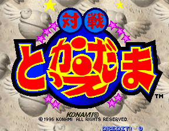
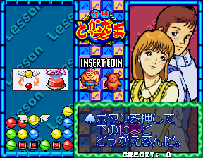

### Tokimeki Memorial Taisen Puzzle-dama (ver JAB)

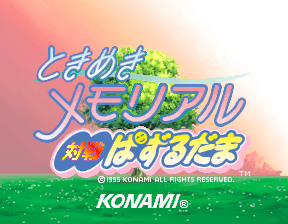

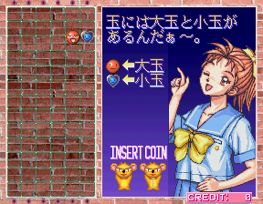

### Dragoon Might (ver AAB)

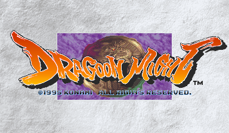
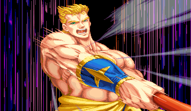
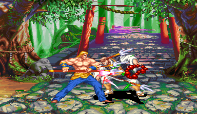
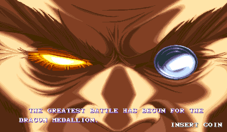
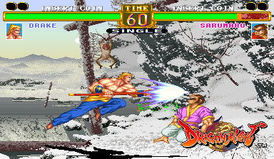

### Salamander 2 (ver JAA)

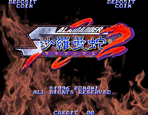
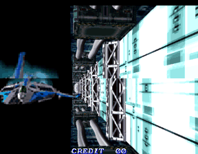
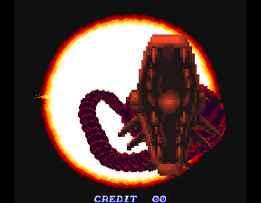
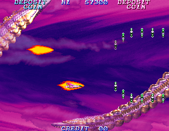
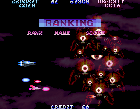

### Lethal Enforcers II: Gun Fighters (ver EAA)

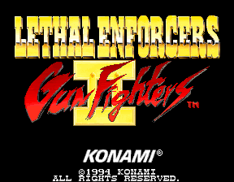
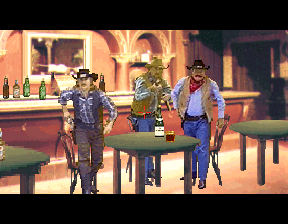
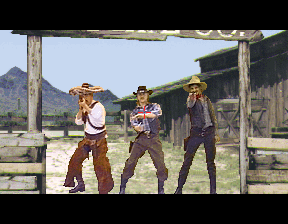
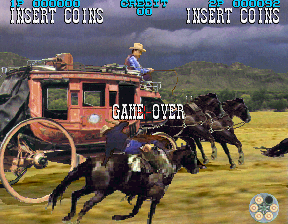

## Installation

The release: copy `releases/Arcade-KonamiGX_<date>.rbf` to `_Arcade/cores` as `KonamiGX.rbf`
and the `.mra` files from `releases/` to `_Arcade` (clones in `_alternatives`), with the MAME
merged ROM sets and `konamigx.zip` (the BIOS, which every set needs) in `games/mame`.

To run a development build:

* `python scripts/build_staged.py`, then `python scripts/deploy.py` with a `mister.env` (see
  `scripts/deploy.py`): the core goes to `_Arcade/cores` as `KonamiGX_NNNNNNNN.rbf` (the name the
  `.mra`'s `<rbf>` tag asks for -- a release is `Arcade-KonamiGX_<date>.rbf` and is renamed to
  `KonamiGX.rbf` when copied there) and the
  `.mra` files to `_Arcade/_Konami System GX`
* Put the MAME merged ROM sets in `games/mame`, plus `konamigx.zip` (the BIOS, which every set
  needs)

### Todo

- [ ] Dragoon Might's DSP RAM test on first boot
- [ ] Dragoon Might's settings save: the EEPROM read-back check
- [ ] The K055673 and K056832 ROM readback windows, screen flip, `hiscore.v`

### Resource usage

The release build (`KonamiGX`, commit `edd366c`, fitter seed 3) on the DE10-nano's Cyclone V
5CSEBA6, speed grade 7, timing met on every clock:

| resource | used | available |
| --- | --- | --- |
| Logic (ALMs) | 30,791 (73%) | 41,910 |
| Block memory bits | 4,308,365 (76%) | 5,662,720 |
| RAM blocks | 539 (97%) | 553 |
| DSP blocks | 75 (67%) | 112 |
| PLLs | 3 | 6 |

The RAM block count is the one to watch: the K054539s' and the DSP's RAMs are in SDRAM for that
reason, the palette's colour bytes are kept once (in the mixer), and CRT Adjust's V-Size ring is
sized to what is left (30 blocks).

## AI Attestation

This core is being developed with heavy use of a frontier coding assistant.

## Verification

Not PCB-validated. MAME is the accuracy reference, with its own acknowledged uncertainties
(`MACHINE_IMPERFECT_GRAPHICS` on every set) noted where they matter.

* The CPU is diffed against MAME's own trace: every write of the BIOS, the memory tests and the
  game's setup, 1.59 million of them, identical in order; the game's main program and interrupt
  handlers each in their own order until a sound reply differs.
* The video path is diffed against MAME's screenshots: a software model of `konamigx_v.cpp`
  reproduces six captured frames pixel for pixel, and the RTL reproduces the model; the whole
  board, from reset, reproduces the title screenshot 64,512 of 64,512 pixels.
* The SDRAM image is downloaded into the controller against a command-decoding chip model and
  every region read back through the port the board uses, against MAME's region images, on two
  simulators.
* Each `.mra` is generated from the driver's `ROM_START` and re-read with mra-tools-c's semantics
  against the expected stream; the DIP switches come from the driver's input ports.

## Acknowledgements

- **Sorgelig** and the **MiSTer-devel team** for the
  [Template_MiSTer](https://github.com/MiSTer-devel/Template_MiSTer) framework and the SDRAM
  controller (`sdram.sv`, via [Arcade-Jackal_MiSTer](https://github.com/MiSTer-devel/Arcade-Jackal_MiSTer),
  with the burst-4 reads from the author's Psikyo core).
- **Jose Tejada** ([jotego](https://github.com/jotego)) for the K053252, K053246/K055673, K054156/K056832
  and K054338 modules and the jtframe primitives from [jtcores](https://github.com/jotego/jtcores).
- The **MAMEdev team** — **R. Belmont, Acho A. Tang, Phil Stroffolino and Olivier Galibert** — for
  `konamigx.cpp`, `konamigx_v.cpp` and the K05xxxx device emulations that are this core's
  specification.
- **furrtek** for the [SiliconRE](https://github.com/furrtek/SiliconRE) notes on the K055555 and the
  K054539.
- **Tobias Gubener** ([TobiFlex](https://github.com/TobiFlex)) for
  [TG68K.C](https://github.com/TobiFlex/TG68K.C).

## Layout

Standard [Template_MiSTer](https://github.com/MiSTer-devel/Template_MiSTer) structure:

| path | contents |
| - | - |
| `sys` | MiSTer framework, vendored from the template |
| `rtl` | core source; vendored modules carry a `PROVENANCE.md` |
| `releases` | `.mra` files |
| `docs` | the roadmap, design notes, lessons |
| `sim` | ModelSim and Verilator testbenches |
| `scripts` | capture and verification tooling |
| `debug` | reference captures from MAME used as ground truth (gitignored) |
| `roms` | your own MAME sets (gitignored, never committed) |

## License

GPL v3 (see `LICENSE`). Imported components keep their own licences and are GPLv3-compatible:
TG68K.C (LGPLv3+), jotego's jtcores modules (GPL-3.0-or-later), the adapted SDR SDRAM controller
(Sorgelig, GPL-3.0-or-later), and the MiSTer framework in `sys/` (GPL-2.0-or-later). Every
modified vendored file states the change in its header, as GPLv3 §5(a) asks. `THIRD-PARTY.md` has
the detail.

Game ROMs contain copyrighted material and are not included. Obtaining them is your
responsibility.
