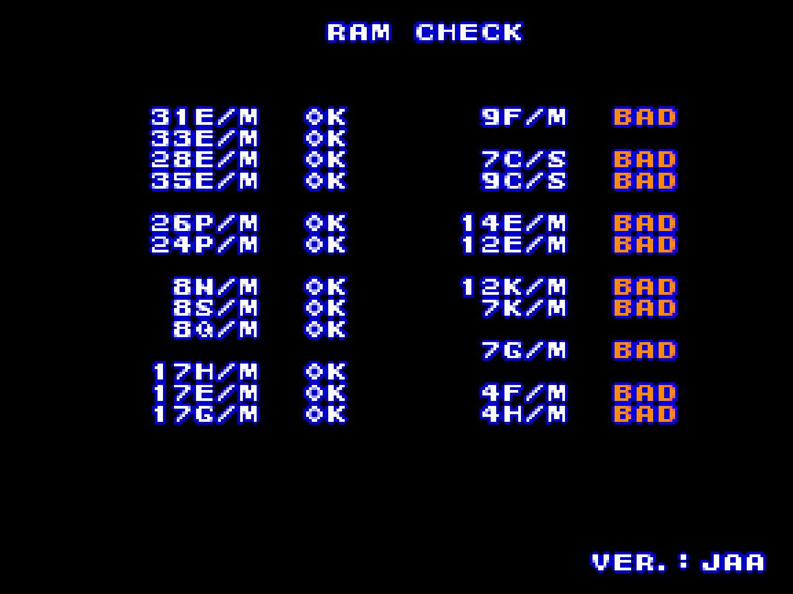

# Konami System GX core for MiSTer

A MiSTer FPGA core for Konami's [System GX](https://en.wikipedia.org/wiki/Konami_System_GX)
arcade hardware (MAME's `konami/konamigx.cpp`), built with Quartus Prime 17.0.2 Lite for the
DE10-nano.

**Status: bring-up.** Daisu-Kiss boots on the board through its power-on tests to its title
screen; there is no sound yet. Nothing is released.

## Contents

- [History](#history)
- [Games](#games)
  - [Supported](#supported)
  - [Not yet](#not-yet)
  - [Out of scope for now](#out-of-scope-for-now)
- [Hardware](#hardware)
  - [Video timing](#video-timing)
- [Screenshots](#screenshots)
- [Installation](#installation)
- [Status](#status)
  - [Todo](#todo)
  - [Resource usage](#resource-usage)
- [AI Attestation](#ai-attestation)
- [Verification](#verification)
- [Acknowledgements](#acknowledgements)
- [Layout](#layout)
- [License](#license)

## History

No release yet. The first build to run on hardware (commit `970423f`) takes Daisu-Kiss from reset
through its RAM, EEPROM and sound-board checks to the title screen.

## Games

The goal is the Type 2 boards of `konamigx.cpp`: one motherboard, one ROM-board type, one screen.
Twenty-two working sets across nine machine configurations, 8 to 24 MB each, every one inside a
32 MB SDRAM module.

### Supported

Sets with an `.mra` in `releases/`. Daisu-Kiss and Twin Bee Yahhoo! have run on the board; the
other eight share their ROM formats and layout method, and their `.mra` images are proven against
MAME's region images in simulation, but have not been launched yet.

| Name | Year | Manufacturer | Tiles | Sprites | Notes |
|-|-|-|-|-|-|
| Daisu-Kiss | 1996 | Konami | 5bpp | 5bpp | ESC `generate_sprites`; on the board to its title |
| Crazy Cross / Taisen Puzzle-dama | 1994 | Konami | 5bpp | 5bpp | 10 MB tile region; mixer priority mode 5 |
| Fantastic Journey / Gokujou Parodius | 1994 | Konami | 5bpp | 5bpp | fantjour's own DMA at 0xdb0000, not written yet |
| Twin Bee Yahhoo! / Magical Twin Bee | 1995 | Konami | 5bpp | 5bpp | tilemode 1 (layers +1); ESC `generate_sprites` |
| Sexy Parodius | 1996 | Konami | 5bpp | 5bpp | 6 MB sprite region, 5 used; `UNEMULATED_PROTECTION` in MAME |

### Not yet

Type 2 sets whose graphics formats the video path does not take yet. Their `.mra` layouts wait on
that, since the image layout is the RTL's.

| Name | Why |
|-|-|
| Dragoon Might | 4bpp sprites, 16 MB of them |
| Taisen Tokkae-dama, Tokimeki Memorial Taisen Puzzle-dama | 6bpp tiles; tkmmpzdm patches its ROM in MAME |
| Salamander 2 | 6bpp tiles and 48-bit sprite rows |
| Lethal Enforcers II | 8bpp tiles and sprites, light guns |
| Winning Spike | 8bpp sprites |

### Out of scope for now

| MAME description | Why |
|-|-|
| Type 1: Racin' Force, Konami's Open Golf Championship, Golfing Greats 2 | `MACHINE_NOT_WORKING` in MAME; K053936 road plane, ADC0834, a LAN device MAME lacks; Open Golf is 33 MB |
| Type 3: Soccer Superstars | Two monitors on alternating frames, a second CRTC and palette, PSAC2 |
| Type 4: Versus Net Soccer, Run and Gun 2, Slam Dunk 2, Rushing Heroes | As Type 3; Rushing Heroes is 59 MB |
| Sexy Parodius (bootleg) | Two OKI6295s for sound, `MACHINE_NOT_WORKING` |

## Hardware

| Chip | Function | Status |
|-|-|-|
| 68EC020 @ 24 MHz | Main CPU | TG68K.C, on its own 24 MHz clock; a 16 KB ROM cache in front of the SDRAM |
| K053252 | CRTC, interrupts | jotego's, verified against MAME's timing |
| K054156 / K056832 | Four tilemap layers, 16 pages of VRAM | Written here (5bpp), pixel-exact against MAME on six frames |
| K053246 / K055673 | 256 sprites, zoom, shadows, 5bpp | jotego's K053246 with GX changes and a keyed line buffer; pixel-exact against MAME |
| K055555 | Priority mixer | Written here from MAME's `konamigx_mixer`, pixel-exact against MAME |
| K054338 | Alpha blending, shadows, background | Written here with the mixer |
| ESC | Sprite-list protection | MAME's `generate_sprites` as a bus master |
| 93C46 | Serial EEPROM | Written here from MAME's `eepromser`; loaded with the set's default image from the `.mra`; not yet saved to the `.nvm` file |
| K056800 | Sound mailbox | A stand-in that answers the power-on test (`rtl/gx_snd_stub.sv`) |
| 68000 + K054539 ×2 + TMS57002 | Sound board | Not yet (Phase 3) |

### Video timing

The dot clock is 6 MHz (`wrport2 & 3` = 0 on every set so far), 384 dots per line and 264 lines
per frame, from the K053252's own registers:

* 6,000,000 / 384 = **15,625 Hz** line rate
* 15,625 / 264 = **59.19 Hz** frame rate

288 × 224 visible. MAME's `konamigx()` declares `set_raw(8000000, 512, ...)`, 60 Hz; the values
above are what the game programs into the CRTC.

## Screenshots

### Daisu-Kiss

The RAM check screen on the first build, with the ten sound-board RAMs failing because the sound
CPU did not exist to test them:

## Installation

There is no release yet. To run a development build:

* `python scripts/build_staged.py`, then `python scripts/deploy.py` with a `mister.env` (see
  `scripts/deploy.py`): the core goes to `_Arcade/cores` as `KonamiGX_NNNNNNNN.rbf` (the name the
  `.mra`'s `<rbf>` tag asks for -- a release is `Arcade-KonamiGX_<date>.rbf` and is renamed to
  `KonamiGX.rbf` when copied there) and the
  `.mra` files to `_Arcade/_Konami System GX`
* Put the MAME merged ROM sets in `games/mame`, plus `konamigx.zip` (the BIOS, which every set
  needs)

## Status

Known issues:
* **No sound.** The K056800 stand-in answers the power-on test and gives a heartbeat; the games'
  sound drivers get nothing else.
* **Sprites drop out on busy lines**: the sprite engine runs out of line time (20 to 118 lines a
  frame in Daisu-Kiss's attract), because a sprite row costs two SDRAM fetches.
* Two shadows on one pixel keep one, where MAME applies both (`docs/MAME_KLUDGES.md`).
* **The EEPROM starts from the driver's default image** (or blank, for daiskiss and sexyparo)
  on every boot and is not saved.
* Daisu-Kiss and Twin Bee Yahhoo! have been launched on the board; the other eight have not.

`docs/MAME_KLUDGES.md` lists what is taken from MAME as behaviour and what is known not to be right.
`docs/ROADMAP.md` is the plan and its progress; `docs/LESSONS_LEARNED.md` is what it cost.

### Todo

- [ ] Sound: the 68000, the K056800, the two K054539s (Phase 3)
- [ ] The remaining Type 2 sets: 4bpp, 6bpp and 8bpp graphics paths, and their `.mra` layouts
- [ ] Launch the nine other `.mra` sets on the board
- [ ] EEPROM save/load through the `.nvm` file
- [ ] fantjour's DMA, tkmmpzdm's ROM patch, the ESC `esc_alert` variants
- [ ] The K055673 and K056832 ROM readback windows, screen flip, `hiscore.v`

### Resource usage

The instrumented build (`KonamiGX_stp`, commit `970423f`) on the DE10-nano's Cyclone V 5CSEBA6,
speed grade 7, timing met on every clock:

| resource | used | available |
| --- | --- | --- |
| Logic (ALMs) | 15,063 (36%) | 41,910 |
| Block memory bits | 3,517,729 (62%) | 5,662,720 |
| RAM blocks | 446 (81%) | 553 |
| DSP blocks | 43 (38%) | 112 |
| PLLs | 3 | 6 |

The RAM block count is the one to watch: the sound board's 64 KB RAM alone is 52 blocks.

## AI Attestation

This core is being developed with heavy use of a frontier coding assistant, in the same way as the
author's Seta, Psikyo, Fuuki and Jaleco MS32 cores.

## Verification

Not PCB-validated. MAME is the accuracy reference, with its own acknowledged uncertainties
(`MACHINE_IMPERFECT_GRAPHICS` on every set) noted where they matter.

* The CPU is diffed against MAME's own trace: every write of the BIOS, the memory tests and the
  game's setup, 1.59 million of them, identical in order; the game's main program and interrupt
  handlers each in their own order until a sound reply differs.
* The video path is diffed against MAME's screenshots: a software model of `konamigx_v.cpp`
  reproduces six captured frames pixel for pixel, and the RTL reproduces the model; the whole
  board, from reset, reproduces the title screenshot 64,512 of 64,512 pixels.
* The SDRAM image is downloaded into the controller against a command-decoding chip model and
  every region read back through the port the board uses, against MAME's region images, on two
  simulators.
* Each `.mra` is generated from the driver's `ROM_START` and re-read with mra-tools-c's semantics
  against the expected stream; the DIP switches come from the driver's input ports.

## Acknowledgements

- **Sorgelig** and the **MiSTer-devel team** for the
  [Template_MiSTer](https://github.com/MiSTer-devel/Template_MiSTer) framework and the SDRAM
  controller (`sdram.sv`, via [Arcade-Jackal_MiSTer](https://github.com/MiSTer-devel/Arcade-Jackal_MiSTer),
  with the burst-4 reads from the author's Psikyo core).
- **Jose Tejada** ([jotego](https://github.com/jotego)) for the K053252, K053246/K055673, K054156/K056832
  and K054338 modules and the jtframe primitives from [jtcores](https://github.com/jotego/jtcores).
- The **MAMEdev team** — **R. Belmont, Acho A. Tang, Phil Stroffolino and Olivier Galibert** — for
  `konamigx.cpp`, `konamigx_v.cpp` and the K05xxxx device emulations that are this core's
  specification.
- **furrtek** for the [SiliconRE](https://github.com/furrtek/SiliconRE) notes on the K055555 and the
  K054539.
- **Tobias Gubener** ([TobiFlex](https://github.com/TobiFlex)) for
  [TG68K.C](https://github.com/TobiFlex/TG68K.C).

## Layout

Standard [Template_MiSTer](https://github.com/MiSTer-devel/Template_MiSTer) structure:

| path | contents |
| - | - |
| `sys` | MiSTer framework, vendored from the template |
| `rtl` | core source; vendored modules carry a `PROVENANCE.md` |
| `releases` | `.mra` files |
| `docs` | the roadmap, design notes, lessons |
| `sim` | ModelSim and Verilator testbenches |
| `scripts` | capture and verification tooling |
| `debug` | reference captures from MAME used as ground truth (gitignored) |
| `roms` | your own MAME sets (gitignored, never committed) |

## License

GPL v3 (see `LICENSE`). Imported components keep their own licences and are GPLv3-compatible:
TG68K.C (LGPLv3+), jotego's jtcores modules (GPL-3.0-or-later), the adapted SDR SDRAM controller
(Sorgelig, GPL-3.0-or-later), and the MiSTer framework in `sys/` (GPL-2.0-or-later). Every
modified vendored file states the change in its header, as GPLv3 §5(a) asks. `THIRD-PARTY.md` has
the detail.

Game ROMs contain copyrighted material and are not included. Obtaining them is your
responsibility.
